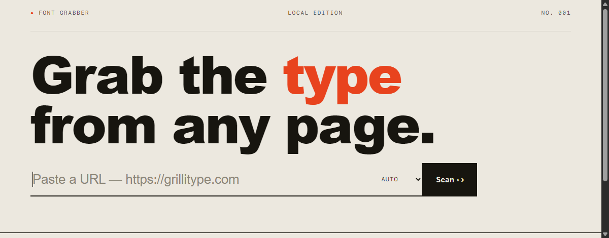
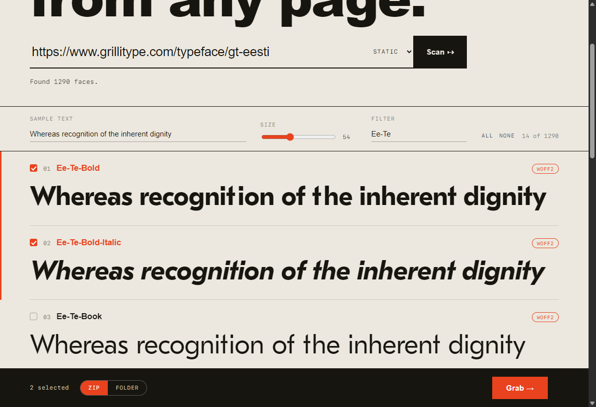
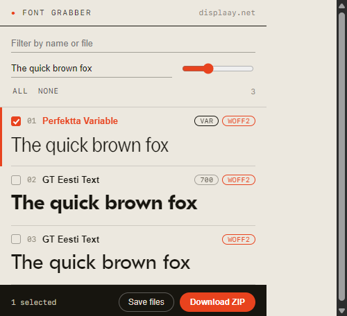
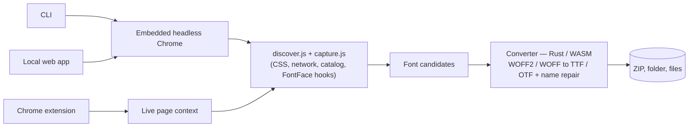

<div align="center">

# Font Grabber

**Scrape the fonts any website uses — and save them as clean `TTF` / `OTF`.**

A CLI, a local web app, and a Chrome extension that share one font engine: discover
every face on a page (even dynamic, variable, and tester-injected ones), then
decompress `WOFF2`/`WOFF` to clean sfnt with the name table repaired and variable
axes preserved.

[](LICENSE)


<br/>



</div>

---

Foundry sites, type testers, SPAs — fonts hide in CSS, in JavaScript, behind
extensionless URLs, and inside Web Workers. Font Grabber finds them all by running
the **same discovery engine** in three places, then converts them locally. Nothing
is uploaded anywhere.

## Contents

- [Showcase](#showcase)
- [Three ways to grab fonts](#three-ways-to-grab-fonts)
- [Features](#features)
- [How it works](#how-it-works)
- [Discovery modes](#discovery-modes)
- [Repository layout](#repository-layout)
- [Requirements & build](#requirements--build)
- [License](#license)

## Showcase

<table>
<tr>
<td width="62%" valign="top">

**Local web app** — scan a URL, preview every face as a live specimen, filter,
then download a ZIP or save to a folder.



</td>
<td width="38%" valign="top">

**Chrome extension** — grab fonts from the page you're on, converted in‑browser.



</td>
</tr>
</table>

## Three ways to grab fonts

### 🖥️ Local web app *(recommended)*

A single Rust binary serves an editorial, type‑foundry UI on `127.0.0.1` — live
specimen previews, editable sample text, filtering, and **ZIP** or **save‑to‑folder**
delivery. No Node, no build step.

```bash
scripts\font-grabber-web.cmd          # build (release) + open the browser
# or directly:
cd core && cargo run -- serve         # http://127.0.0.1:8787
```

### 🧩 Chrome extension

A Manifest V3 extension ([`extension/`](extension/)) that detects fonts on the
current tab, previews them, and downloads clean `TTF`/`OTF` **entirely in the
browser** — the `WOFF2 → sfnt` conversion is the same Rust code compiled to
WebAssembly. It even captures variable fonts from type testers (e.g. Displaay).

```bash
scripts\build-extension.cmd           # build wasm/ → extension/convert.wasm
```

Then `chrome://extensions` → **Developer mode** → **Load unpacked** → pick
`extension/`. Details in [extension/README.md](extension/README.md).

### ⌨️ CLI

```bash
cd core
cargo run -- grab https://example.com                      # discover → select → convert → save
cargo run -- grab https://example.com --all -o ./out       # grab everything, no prompts
cargo run -- grab https://displaay.net/typeface/perfektta --all   # full variable family
cargo run -- scan https://example.com --json              # discovery only (machine‑readable)
```

```text
$ font-grabber grab https://displaay.net/typeface/perfektta --all
✓ Found 22 faces (browser)
✓ Saved 22 fonts → ./fonts/displaay.net
  Perfektta-Variable-400.ttf   (variable · wght 100–900, slnt)
  Perfektta-Bold-700.ttf   Perfektta-Bold-Italic-700.ttf   …
```

## Features

- **Finds what others miss** — `@font-face` in CSS, fonts loaded at runtime,
  extensionless API endpoints, Web‑Worker fetches, and JS‑injected `FontFace`s.
- **Whole families, not fragments** — reads a foundry's own catalog to enumerate
  every weight + italic *and* the master variable font, up front.
- **Faithful conversion** — `WOFF2` (Brotli) and `WOFF` (zlib) → clean sfnt, name
  table repaired, **variable axes (`fvar`/`gvar`) preserved**. Byte‑identical across
  the CLI, web app, and extension.
- **Live previews** — every candidate rendered in its real typeface with editable
  sample text and adjustable size.
- **Flexible output** — ZIP, a chosen folder, or individual files.
- **100% local** — no servers, no uploads, no telemetry.

## How it works

One discovery engine ([`extension/discover.js`](extension/discover.js) +
`capture.js`) runs everywhere. The Rust apps drive it through an **embedded headless
Chrome** (via CDP — no separate WebDriver to install); the extension runs it in the
page directly. Candidates then flow through the shared Rust converter.



The converter is written once in Rust ([`core/src/convert`](core/src/convert)) and
compiled to `wasm32-unknown-unknown` for the browser ([`wasm/`](wasm/)) with a tiny
hand‑rolled ABI — no `wasm-bindgen`.

## Discovery modes

| Mode | Browser? | Catches | Use it for |
|------|:--------:|---------|------------|
| `auto` *(default)* | static **+** headless Chrome, merged | everything; falls back to static if Chrome is absent | most sites |
| `static` | none | `@font-face` in HTML/linked CSS | speed; CI; simple sites |
| `render` | headless Chrome only | dynamic / extensionless / catalog fonts | type testers, SPAs |

## Repository layout

```text
.
├── core/        Rust crate — CLI + local web server (the engine)
│   └── src/{app,cli,convert,discovery,domain,fetch,output,support,web}
├── wasm/        Rust → WebAssembly converter (used by the extension)
├── extension/   Chrome MV3 extension (popup UI + shared discover.js + WASM)
├── scripts/     Windows build / launch helpers (.cmd)
└── docs/        screenshots
```

## Requirements & build

- **Rust** (`rustup`) — builds the CLI and web app.
- **Chrome / Chromium installed** — used by `auto`/`render` discovery (auto‑detected;
  `static` mode needs no browser).
- **`wasm32-unknown-unknown` target** — only to (re)build the extension's converter:
  `scripts\build-extension.cmd` handles it.

```bash
# CLI + web app
cd core && cargo build --release

# Extension converter (WASM)
scripts\build-extension.cmd
```

More on the engine internals: [core/README.md](core/README.md).

## License

[ISC](LICENSE) © Piwqust
